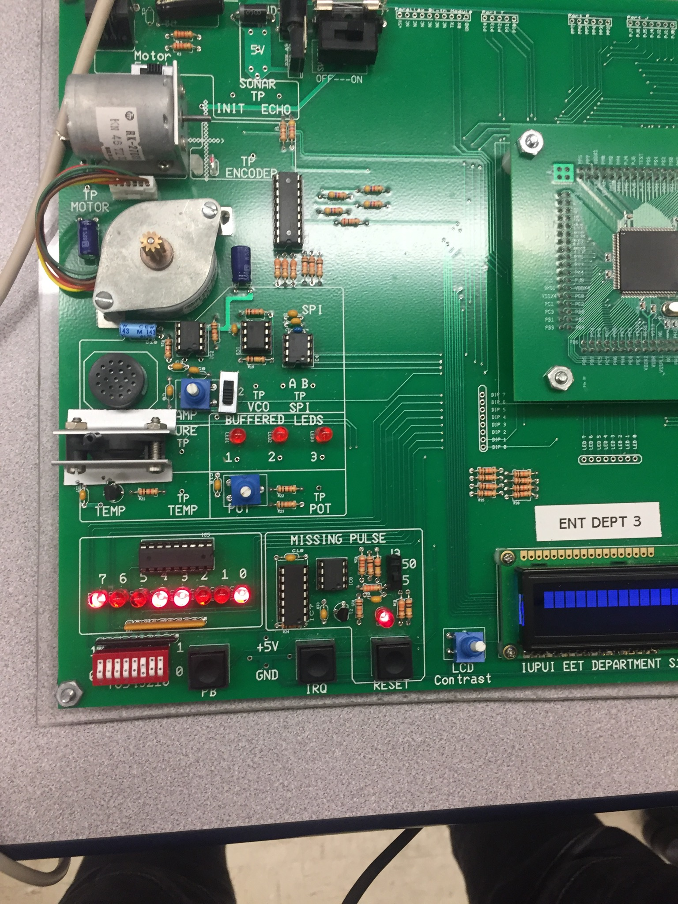

# MotorPWM
### Overview
This is C code used to create a PWM drive for a stepper motor. A motor is controlled using dipswitches. One switch turns the motor on and off. A second switch changes speed. This also includes an LED that flashes at different speeds, to visualize the engergizing cycle of the stepper motor. This project was used to demonstrate the use of an Enhanced Capture Timer handler in a Task Scheduler. This code was created using Code Warrior IDE. This was a project for ECET 309, Advanced Embedded Micro-Controllers.

### Hardware

**NXP MC9S12XEP100 Dev Kit** - This dev kit includes the MC9S12XEP100 Micro-Controller, JTAG debugger and stepper motor on a single board

### Files of Intrest

**ECET309_Lab9/Sources/ECT.C** - Create an enhanced capture timer 

**ECET309_Lab9/Sources/main.C** - Initiallizes the micro-controller, then a task scheduler runs operation

**ECET309_Lab9/Sources/functions.C** - Contains the functions used to create the Task Scheduler, checks the dipswitches, and runs the stepper motor  
